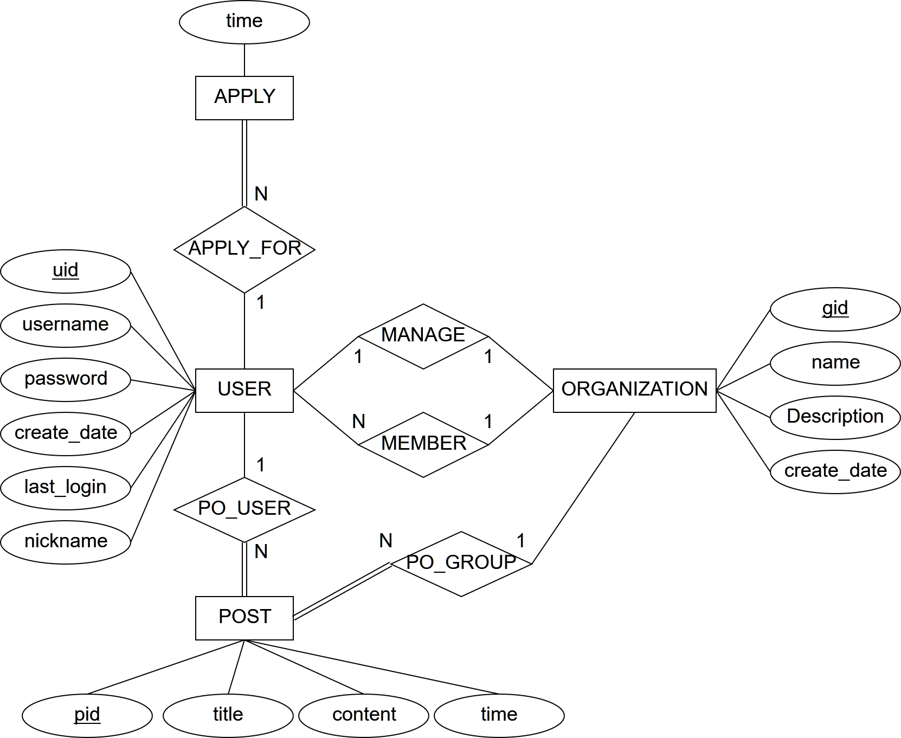

# DB2017FALL
CSIE30600 / 2017 FALL / Term Project

## Demonstration Video
https://www.youtube.com/watch?v=rCZx3Wo87d4

## Introduction
程式主要是提供使用者自行創建群組，並在群組內張貼文章的平台。每位使用者均可以創建群組，假如有其他使用者想要加入，必須先申請，經過群組管理員同意後才會正式成為群組成員。
群組的管理者就是創建者，管理者可以針對自己的群組做下列動作：刪除每一則文章、刪除群組、編輯群組名稱&說明、剔除成員、審查申請成員。
群組的成員則可以做以下動作：張貼文章、編輯或刪除自己的文章、退出群組。

## ER diagram

## Relation schema

## Implement
Backend: PHP + MySQL  
Frontend: Bootstrap, jQuery

